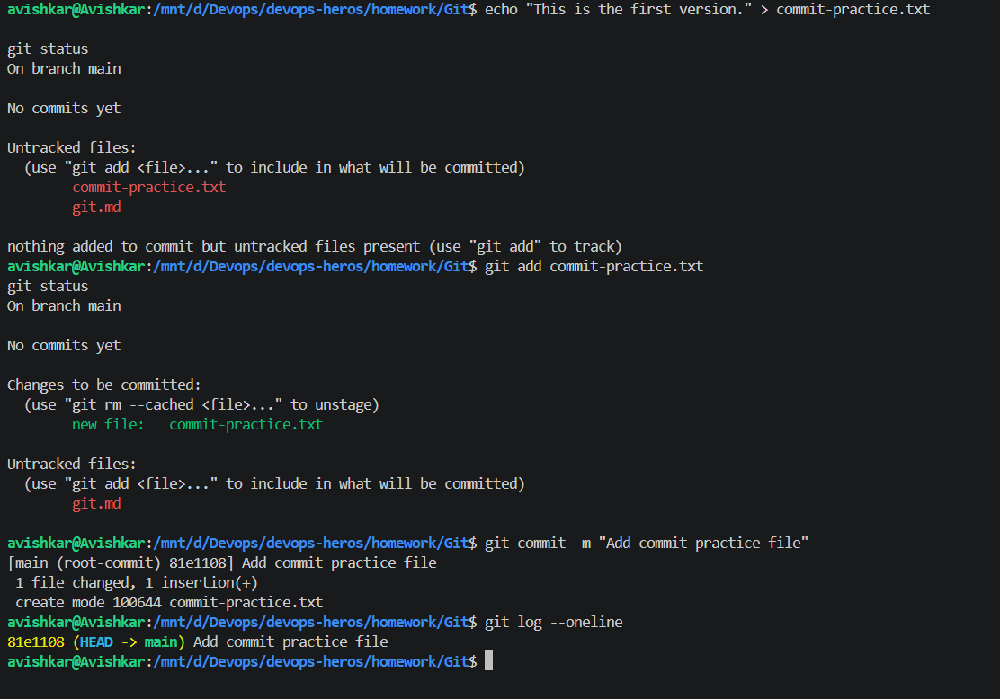
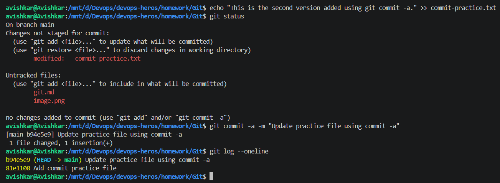
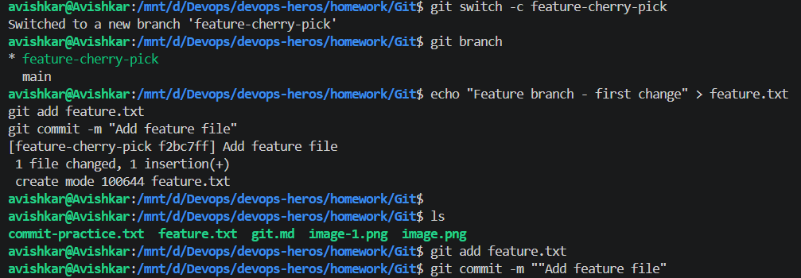
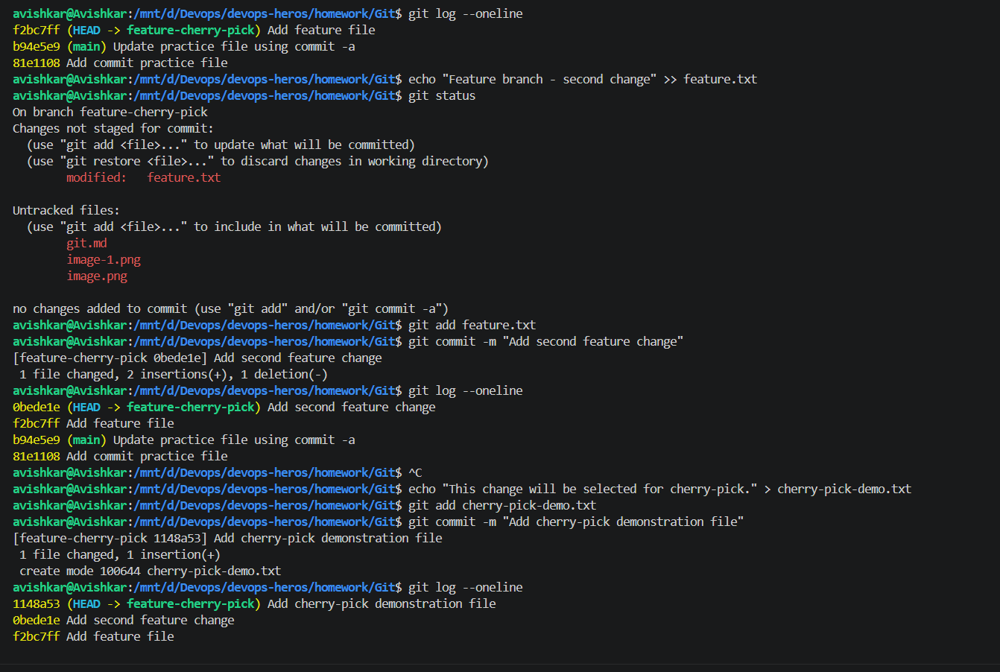
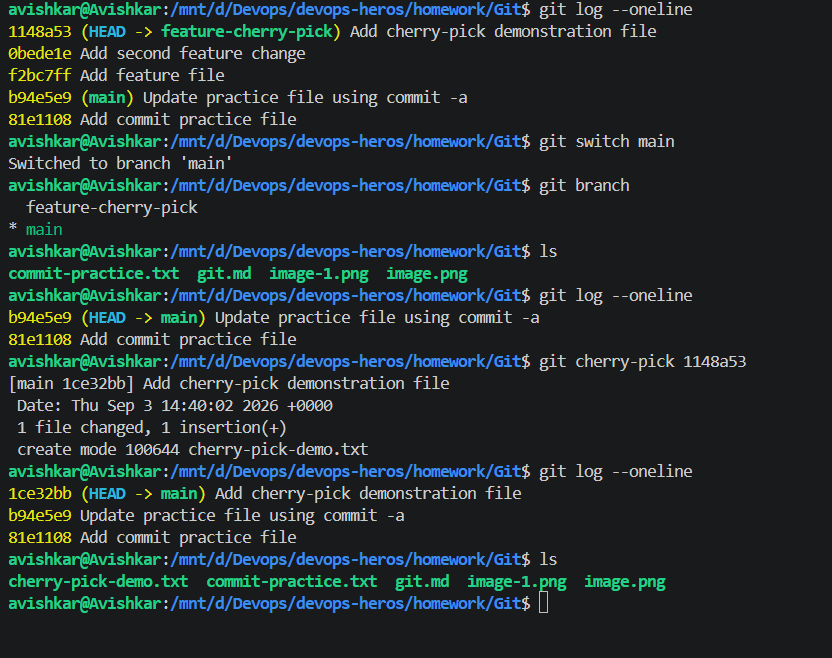

# Git

I first made two commits on the main branch. After that, I created a new branch called feature-cherry-pick and made three more commits there. I used git log --oneline to see all the commits and their commit IDs.

I then chose the commit 1148a53, which added cherry-pick-demo.txt. I switched back to the main branch and ran:

git cherry-pick 1148a53

This brought only that particular commit and its changes into main. I checked the result using git log, ls, and cat cherry-pick-demo.txt to make sure the file was added successfully.

