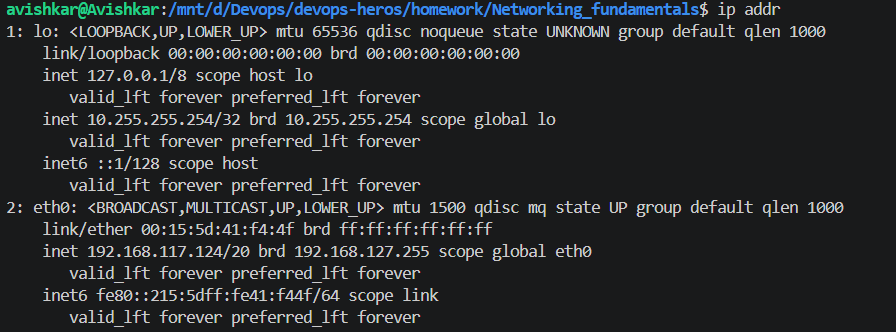
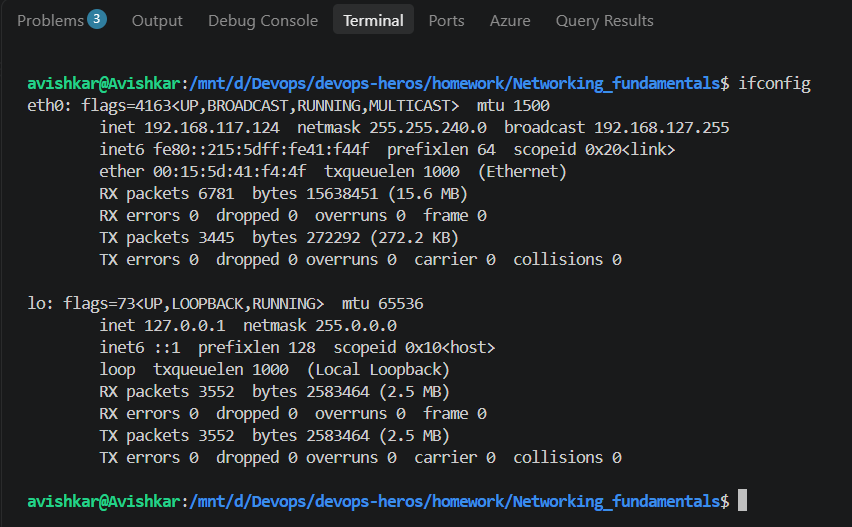
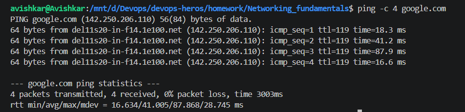
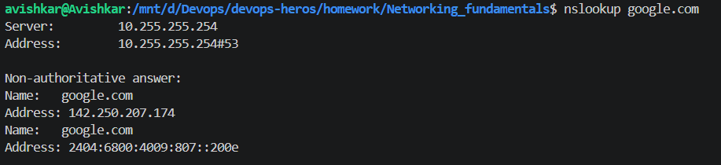
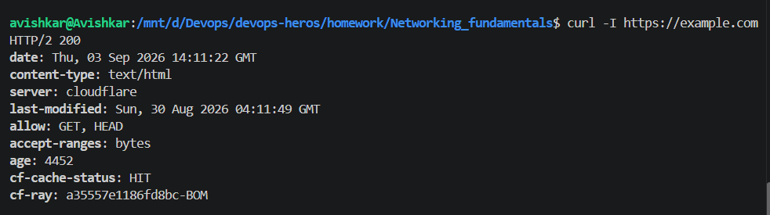
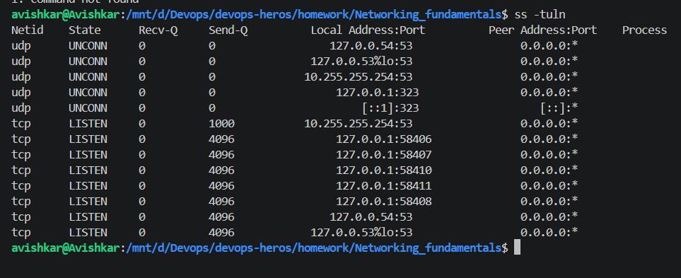
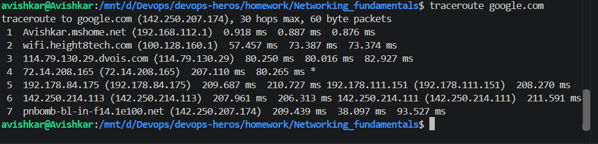
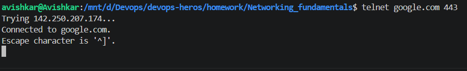

# Networking Fundamentals

I used ip addr to view the network interfaces and IP addresses configured on my system. It shows details such as the interface name, IPv4 and IPv6 addresses, and the current status of the interfaces.

----
I used ifconfig to check the configuration of the network interfaces. It displays information such as IP addresses, MAC addresses, and network traffic statistics.

----

I used ping -c 4 google.com to test network connectivity. The -c 4 option sends four packets and then stops automatically. The output shows whether the destination is reachable, along with response times and packet loss.

----

I used nslookup google.com to query the DNS information for a domain. It helped me see how the domain name is resolved to an IP address by a DNS server.

----

I used curl to send an HTTP request to a web server. The -I option requests only the response headers, which allowed me to check information such as the HTTP status code and server response headers.

----

I used ss -tuln to view the TCP and UDP ports that are currently listening on my system. The options -t and -u show TCP and UDP sockets, -l shows listening ports, and -n displays port numbers without resolving service names.

----

I used traceroute google.com to trace the path taken by network packets from my system to the destination. Each line in the output represents a network hop between my system and the destination.

----

I used telnet google.com 443 to test connectivity to a specific port on a remote server. This command attempts to establish a connection to the specified host and port, which can be useful for checking whether a network service is reachable.

