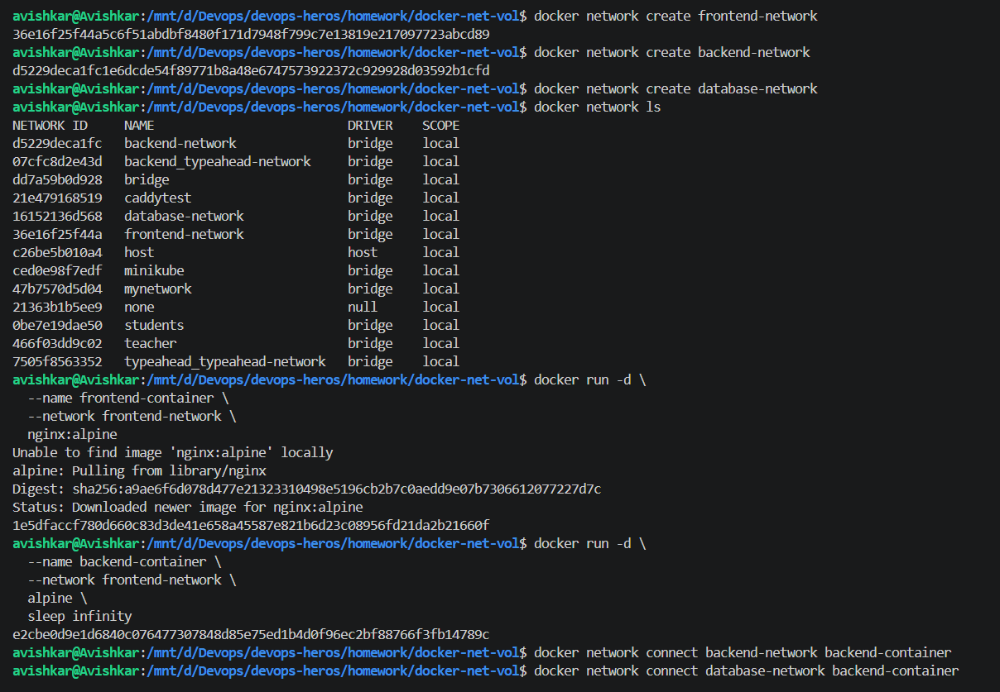
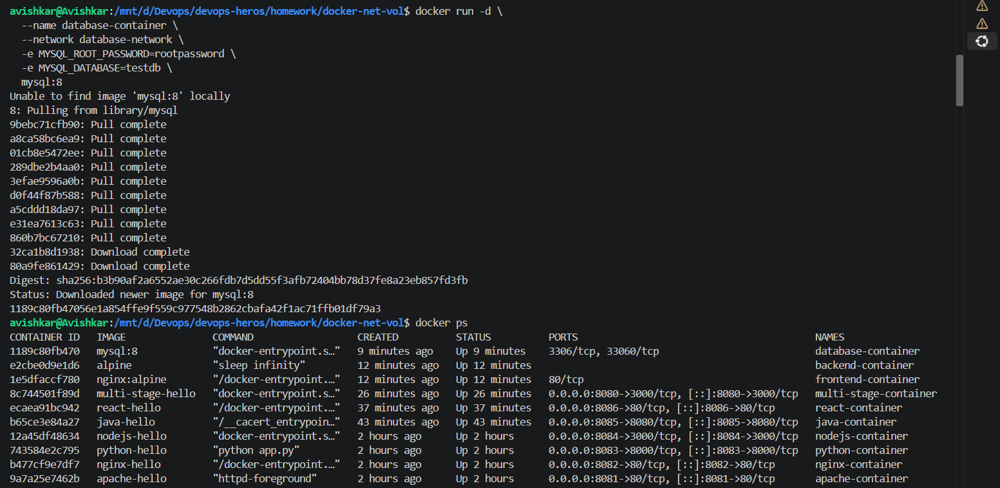
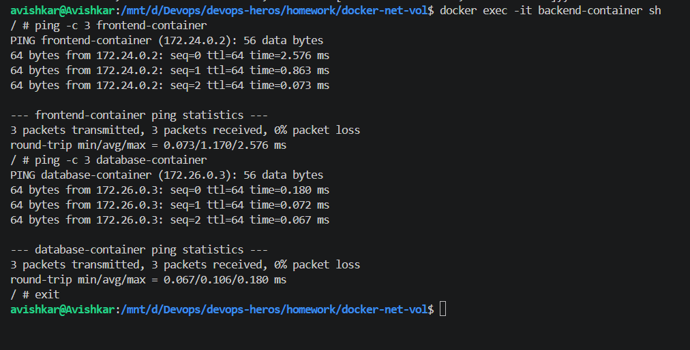
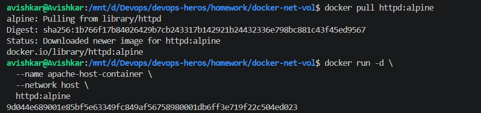
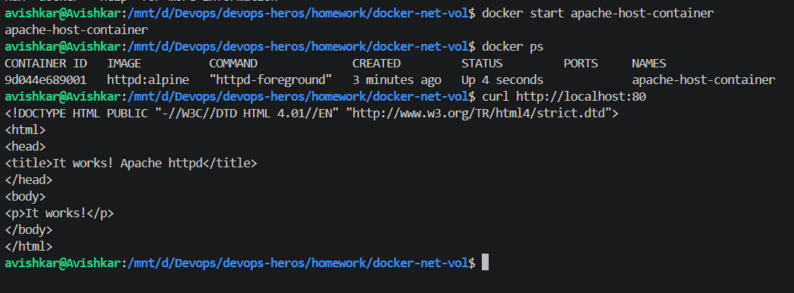
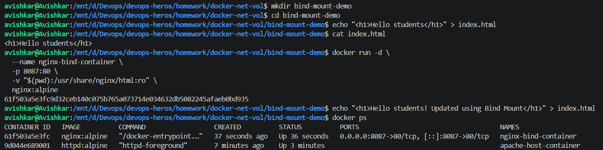

# Task 1: Docker Container Networking

# Task 2: Host Network

# Task 3: Bind Mount

## Task 4: Overlay Network

An overlay network is a Docker network that allows containers running on different Docker hosts to communicate with each other. Unlike a bridge network, which is mainly used for containers on the same host, an overlay network is designed for distributed environments.

Overlay networks are commonly used with Docker Swarm and are useful when an application is deployed across multiple servers. For example, a frontend container running on one server can communicate with a backend container running on another server through the same overlay network.

This type of network is useful for microservices and distributed applications where containers need secure communication across multiple Docker hosts.