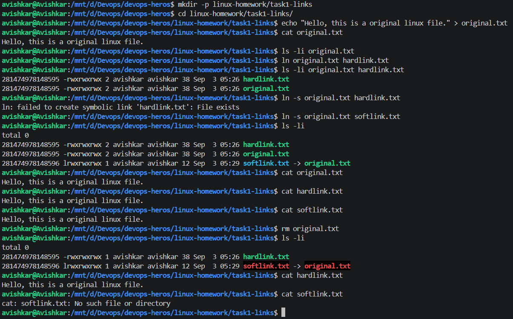
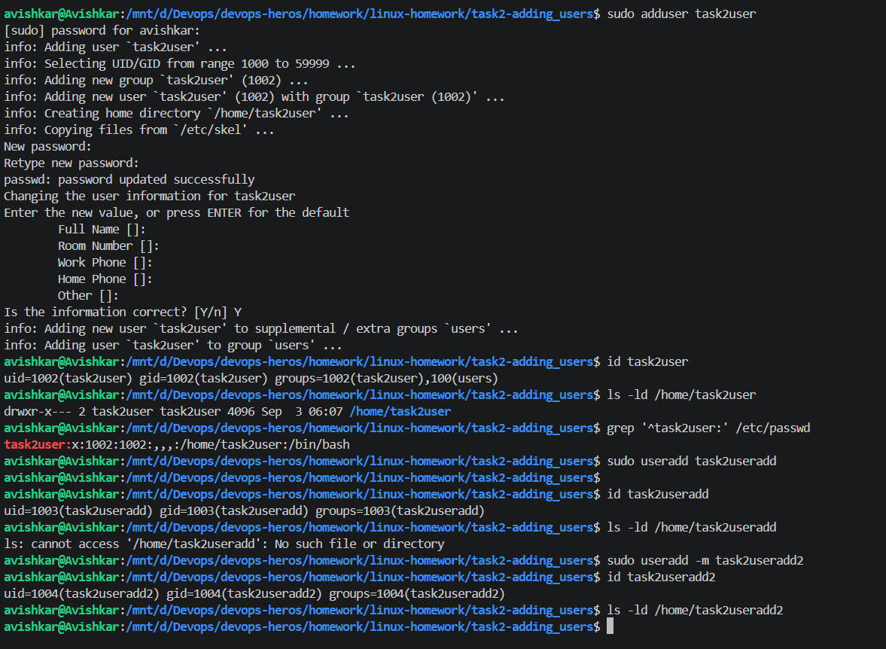
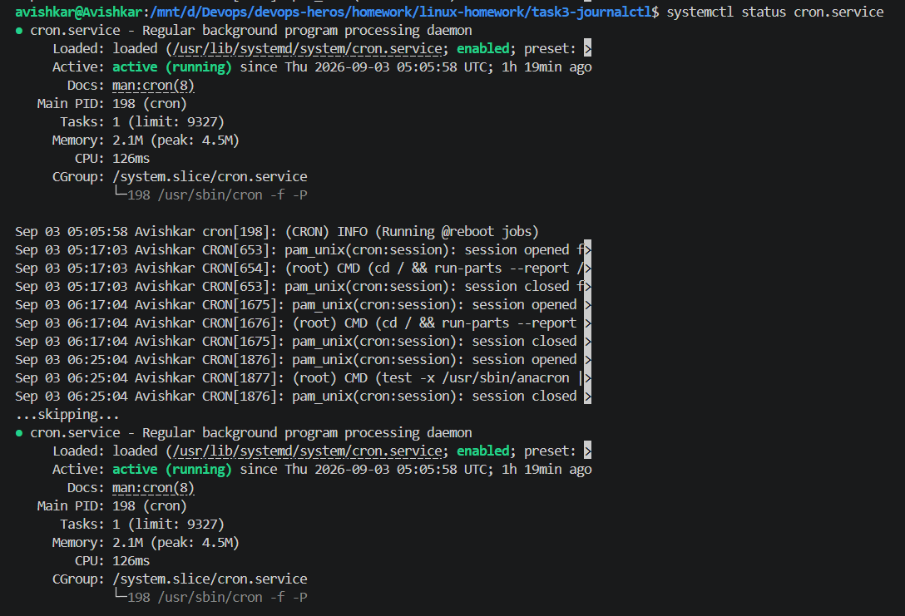
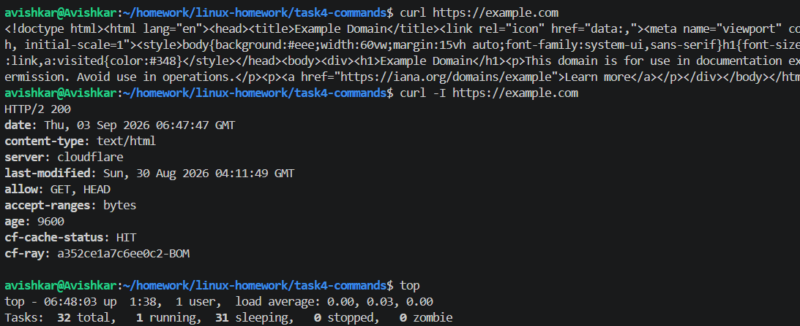
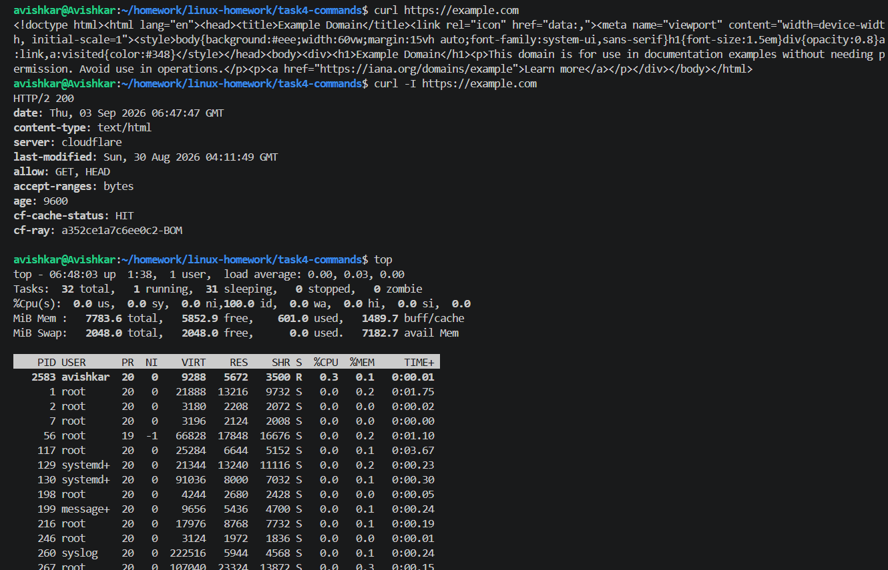

# Task 1: Soft Link and Hard Link

I created an original.txt file and then created both a hard link and a soft link for it.

The main thing I noticed is that the hard link and the original file have the same inode number. This means that both names point to the same file data. Even after I deleted original.txt, I was still able to read the contents using hardlink.txt.

The soft link works differently. It points to the path of the original file, which can be seen as softlink.txt -> original.txt. After deleting original.txt, the soft link stopped working because the file it was pointing to no longer existed.

So, in simple terms, a hard link is another name for the same file, while a soft link is like a shortcut that points to the original file.

# Task 2: adduser vs useradd

I tried both adduser and useradd to understand the difference between them. When I used adduser, it guided me through the process, asked me to set a password, created a group for the user, and also created the user's home directory automatically. On the other hand, when I used useradd without any options, the user was created successfully, but no home directory was created. I then used useradd -m, where the -m option created the home directory as well. From this, I understood that adduser is more convenient for manually creating users on Ubuntu, while useradd gives more direct control and may require additional options depending on what needs to be configured.

# Task 3: journalctl

I used journalctl to understand how Linux system logs can be viewed and checked. I first viewed the latest system logs and then checked the logs for cron.service using journalctl -u cron.service. This showed me the events and messages related specifically to the cron service. I also used systemctl status cron.service to confirm that the service was running. Finally, I checked the logs from the current system boot. Through this task, I understood that journalctl is useful for checking system and service logs, especially when trying to find warnings, errors, or understand what happened with a particular service.

# Task 4: Commands

I used whoami to check the currently logged-in user. I used grep to search for specific text inside a file. I also used chmod to change the permissions of a shell script and make it executable. Using curl, I made an HTTP request and checked the response from a website. Finally, I used top and htop to monitor the running processes and view CPU and memory usage. This task helped me understand how these commands are used for searching, managing permissions, checking users, making network requests, and monitoring system processes.

