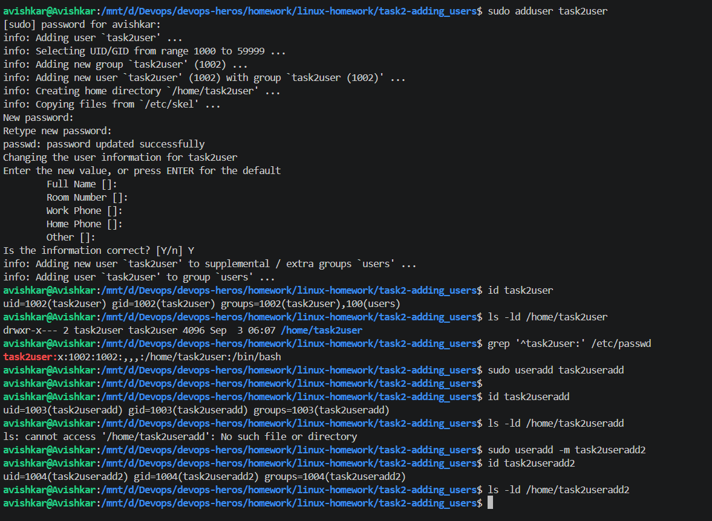

I tried both adduser and useradd to understand the difference between them. When I used adduser, it guided me through the process, asked me to set a password, created a group for the user, and also created the user's home directory automatically. On the other hand, when I used useradd without any options, the user was created successfully, but no home directory was created. I then used useradd -m, where the -m option created the home directory as well. From this, I understood that adduser is more convenient for manually creating users on Ubuntu, while useradd gives more direct control and may require additional options depending on what needs to be configured.