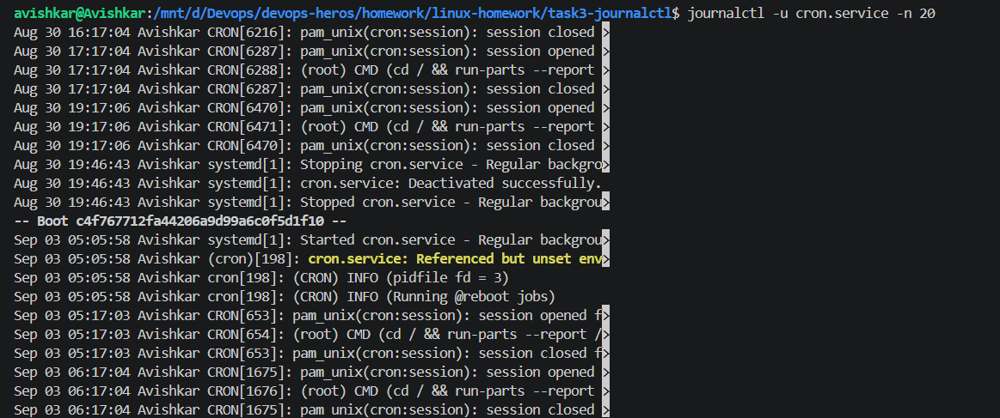
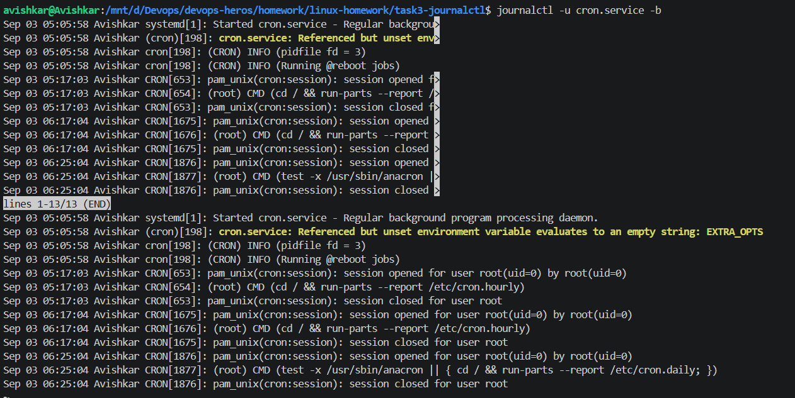

# Task 3: journalctl

I used journalctl to understand how Linux system logs can be viewed and checked. I first viewed the latest system logs and then checked the logs for cron.service using journalctl -u cron.service. This showed me the events and messages related specifically to the cron service. I also used systemctl status cron.service to confirm that the service was running. Finally, I checked the logs from the current system boot. Through this task, I understood that journalctl is useful for checking system and service logs, especially when trying to find warnings, errors, or understand what happened with a particular service.

