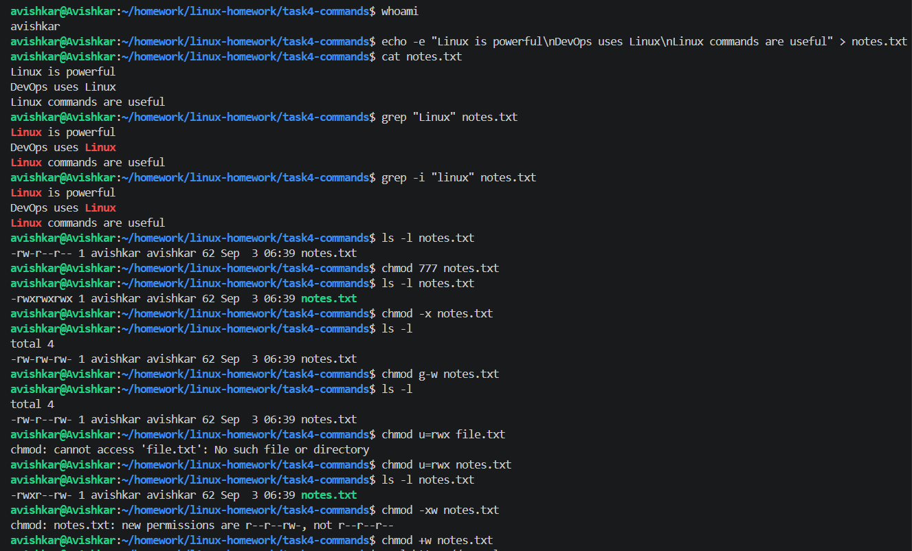
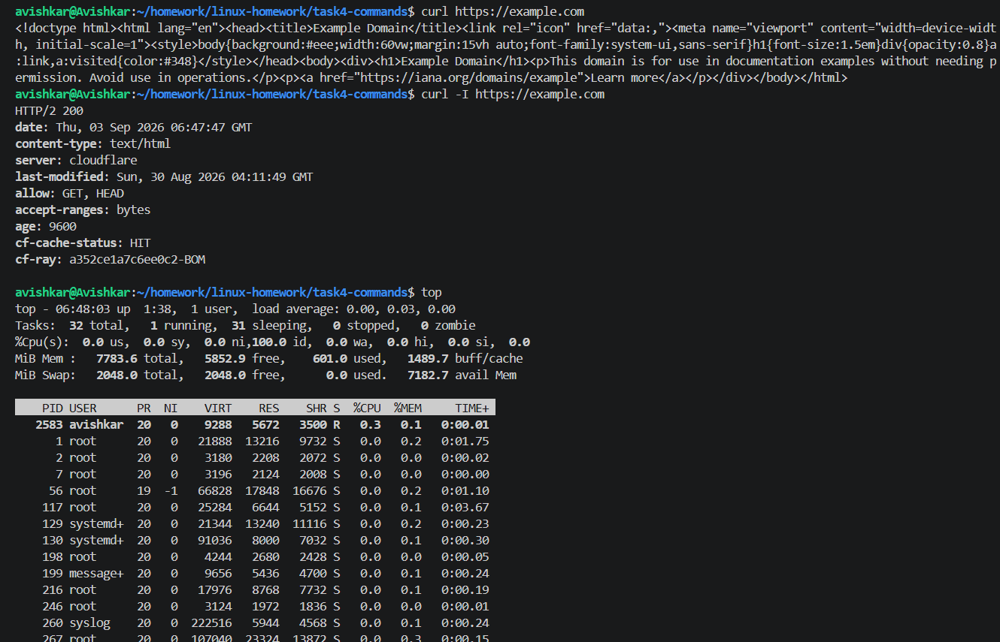
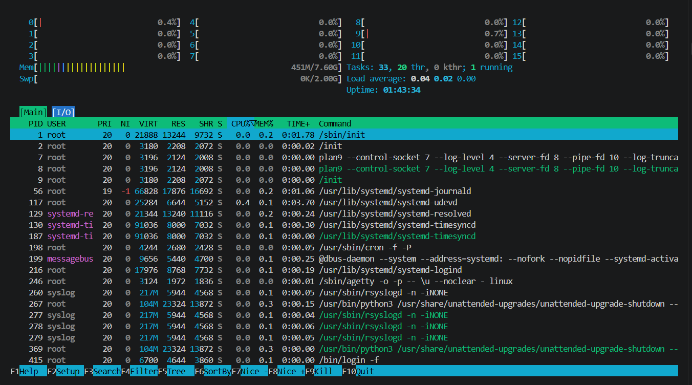

# Task 4: Commands

I used whoami to check the currently logged-in user. I used grep to search for specific text inside a file. I also used chmod to change the permissions of a shell script and make it executable. Using curl, I made an HTTP request and checked the response from a website. Finally, I used top and htop to monitor the running processes and view CPU and memory usage. This task helped me understand how these commands are used for searching, managing permissions, checking users, making network requests, and monitoring system processes.

