# multi-stage-dockerfile

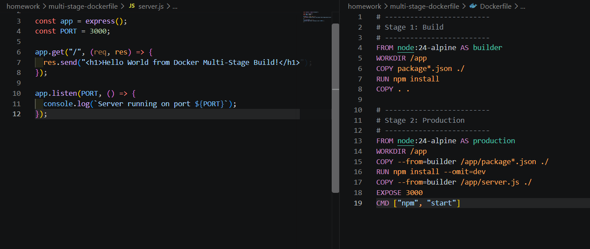
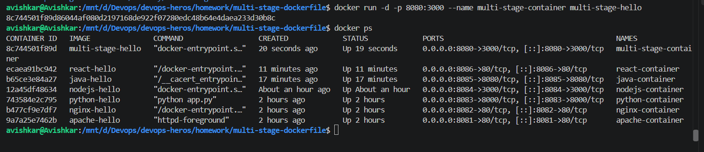
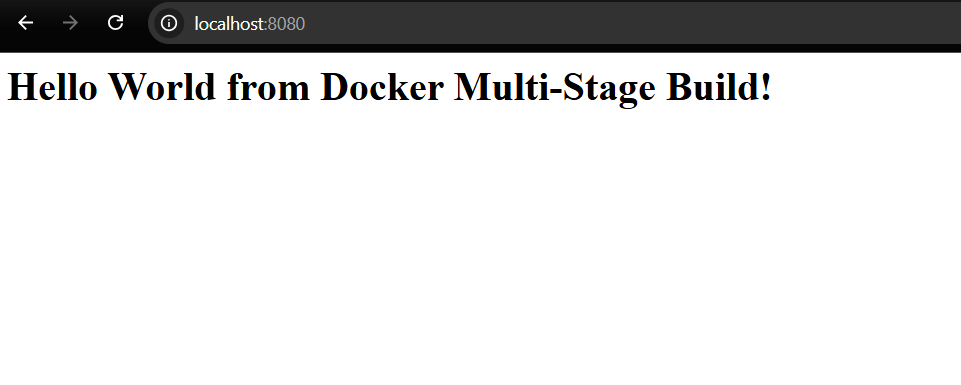

# Docker Multi-Stage Build Homework

## Student Details

**Name:** Avishkar  
**Enrollment Number:** 10065
---

## Task 1: Multi-Stage Docker Build

I used a multi-stage Dockerfile to build and run a Node.js application. The Dockerfile uses separate build and production stages. The first stage installs the required dependencies, while the second stage creates the final image with only the files needed to run the application.

### Build Command

```bash
docker build -t multi-stage-hello .

# Apache-app


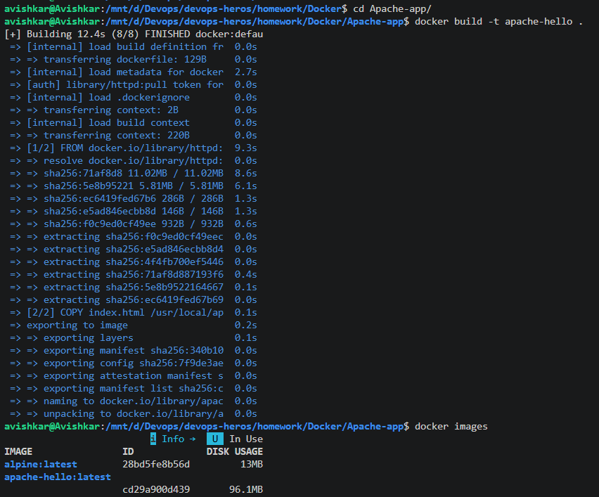
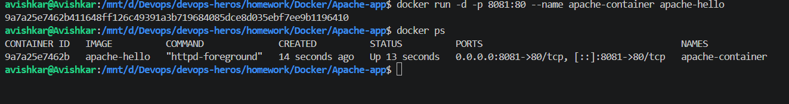

# nginx-app

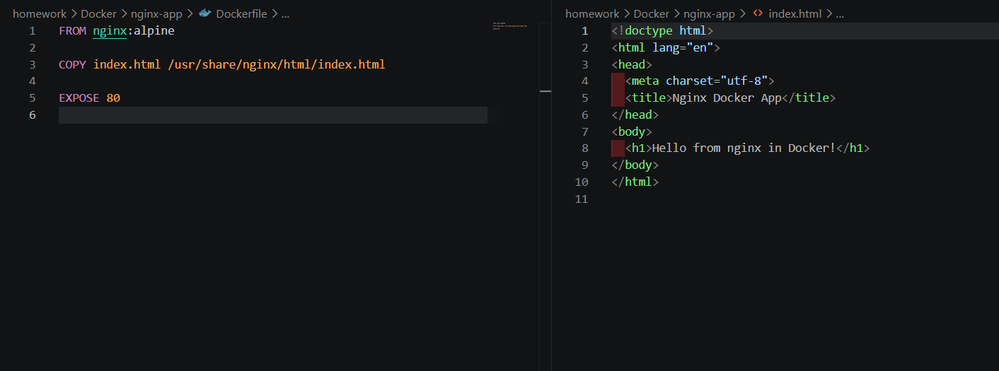
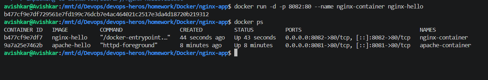


# python-app


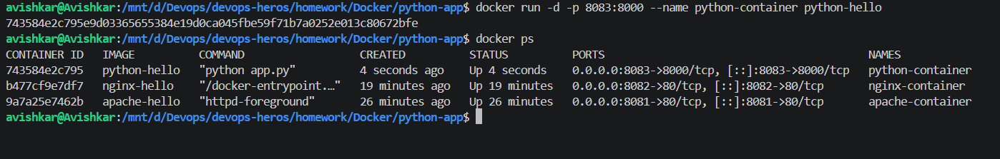


# nodejs-app

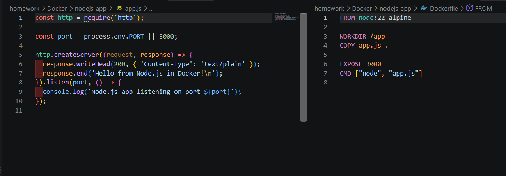


# java-app

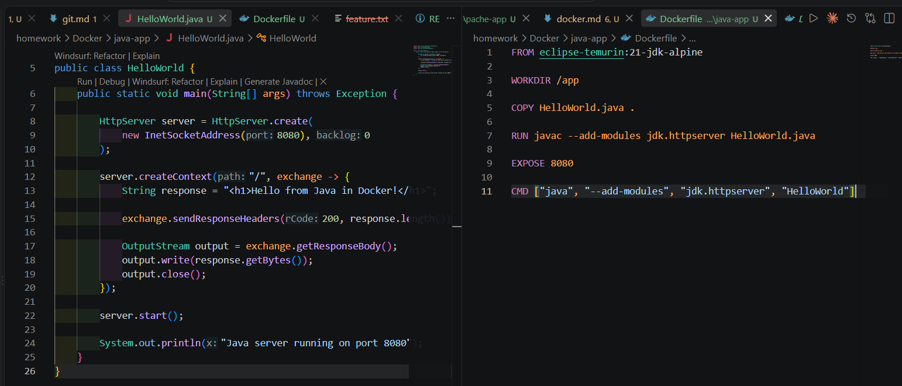
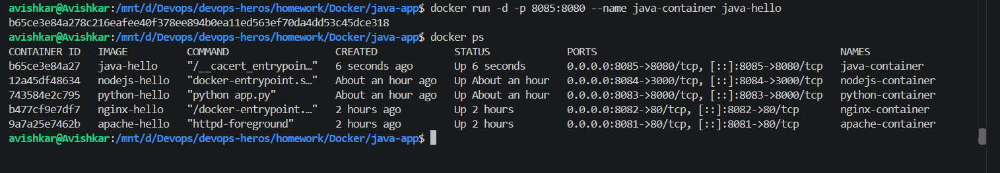

# React-app

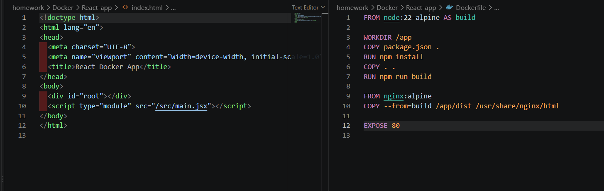


